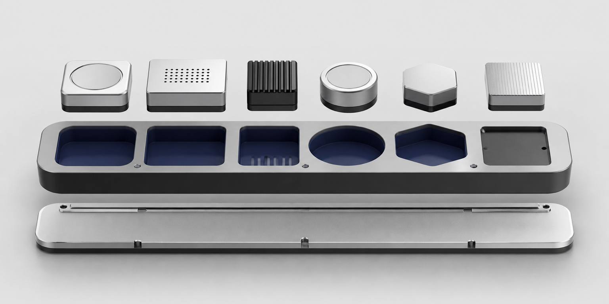

# Personal Agent Toolkit



A local-first toolkit that keeps guidance for important choices private, returns to original
sources, and helps AI adapt only when its current understanding of the user matters. The
marketplace currently contains:

- **Sense** keeps a small set of private, user-controlled guidance for important choices available
  across AI tools.
- **Corpus** connects a task to the files, email, and completed AI work that belong with it, then
  opens the original sources needed now.
- **Hypes** gives an agent a private, revisable relationship model of the user, then uses only the
  relevant relationships to change later interpretation, explanation, and choice.

This repository contains plugin code, manifests, assets, and dependency locks, but no user data. It
does not contain active Sense guidance, a Corpus catalog or index, a Hypes relationship-model
database, source documents, saved context, provider conversations, credentials, or runtime
databases.

## When the plugins run

The user does not need to name a plugin on every request. Once installed and enabled, Codex or
Claude can select them when a task calls for them:

- Sense can be selected when an important choice may depend on durable intent, responsibility, or
  a lesson that remains useful in different contexts.
- Corpus can be selected when a task needs to understand an ongoing body of work or locate,
  compare, and verify its original sources.
- Hypes can be selected when the agent's current model of the user could change an
  interpretation, explanation, question, or choice, or when the interaction changes that model.
  It should not load merely because a response is substantive.

Simple retrieval, literal transformations, and direct one-step actions should not load unrelated
personal context. Codex and Claude decide when to use a skill, so a relevant skill may not be used
on every response. Start a new task or session after installing or updating a plugin so the new
version can load.

## Requirements

- macOS
- [uv](https://docs.astral.sh/uv/)
- Codex, Claude Code, or a local Claude Cowork session with plugin support

The launchers provision isolated Python environments from the committed lockfiles. Python 3.11 or
newer is required.

## Choose the smallest installation that fits

- **Local only:** install any Sense, Corpus, or Hypes plugins you want. No gateway, tunnel, ChatGPT
  registration, hosted server, or cloud bill is needed.
- **Personal ChatGPT:** keep those installed products and add the optional `gateway/` component.
  Create one OpenAI Secure MCP Tunnel and one developer connection for each product you want in
  Chat. One macOS LaunchAgent supervises all selected products and tunnels. Product data remains on
  that Mac; no public inbound server or AWS deployment is needed.

Hosted or multi-user execution is not part of this toolkit. It would require a separate product and
security boundary rather than another mode inside the local plugins.

The gateway is toolkit infrastructure, not a fourth plugin. It never creates a combined tool
namespace. A user may select Sense only, Corpus plus Hypes, or all three; local and Chat surfaces
continue to register and call each selected product independently.

## Install

Install from this published repository, or from a local checkout when developing the toolkit
itself. Both paths register the same `personal-agent-toolkit` marketplace, and a marketplace name
can be registered only once.

### Codex

```sh
codex plugin marketplace add Ruzzy77/personal-agent-toolkit
codex plugin add sense@personal-agent-toolkit
codex plugin add corpus@personal-agent-toolkit
codex plugin add hypes@personal-agent-toolkit
```

To install from a local checkout instead, clone this repository and run
`codex plugin marketplace add .` from its root in place of the first command.

### Claude Code

```sh
claude plugin marketplace add Ruzzy77/personal-agent-toolkit
claude plugin install sense@personal-agent-toolkit --scope user
claude plugin install corpus@personal-agent-toolkit --scope user
claude plugin install hypes@personal-agent-toolkit --scope user
```

To install from a local checkout instead, clone this repository and run
`claude plugin marketplace add .` from its root in place of the first command.

Start a new task or session after installing or updating a plugin.

### Claude Cowork

The repository is also a Cowork plugin marketplace. In Claude, open
`Customize → Plugins → Add marketplace` and enter:

```text
Ruzzy77/personal-agent-toolkit
```

Install Sense, Corpus, and Hypes from that marketplace, then start a new local
Cowork session. Full local MCP functionality is intended for Cowork and Code;
ordinary Chat sessions are not a supported runtime target for this release.

### Personal ChatGPT through the optional gateway

The local product packages intentionally contain no `.app.json` or maintainer-owned ChatGPT
connection. To use selected products in a private Chat, create your own Platform tunnels and
developer connections, then use the optional [gateway guide](./gateway/GUIDE.md). The gateway:

- discovers selected products already installed and enabled in this Codex marketplace, or accepts
  an equivalent exact local package root;
- starts their packaged MCP launchers against the same existing local data;
- exposes fixed loopback paths through one gateway process;
- keeps one tunnel and one ChatGPT registration per selected product; and
- installs one supervising macOS LaunchAgent, regardless of whether one, two, or three products are
  selected.

Enabling it does not reinstall a product or migrate its data. Stopping the one gateway service
returns to local-only use without removing Sense, Corpus, Hypes, or their state. After a product
update, rerun the gateway installer and restart that LaunchAgent so the selected installed roots are
refreshed.

Each raw developer connection exposes its product MCP. The local Codex and Claude packages also
contain the product skill; a raw Chat connection does not automatically load that local skill.

Private developer registration is not public submission. Public directory distribution remains a
separate review process for each independently installable product.

See OpenAI's documentation for
[private tunnels](https://developers.openai.com/api/docs/guides/secure-mcp-tunnels),
[developer testing](https://developers.openai.com/plugins/deploy/connect-chatgpt),
[plugin packaging](https://developers.openai.com/plugins/build/plugins), and
[public submission](https://developers.openai.com/plugins/deploy/submission).

## Update an installed plugin

A marketplace registered from this published repository serves what has been pushed to `main`.
Refresh the marketplace snapshot first, then update each plugin.

### Codex

```sh
codex plugin marketplace upgrade personal-agent-toolkit
codex plugin add hypes@personal-agent-toolkit
```

Codex has no separate plugin update command; installing again from the refreshed snapshot applies
the new version.

### Claude Code

```sh
claude plugin marketplace update personal-agent-toolkit
claude plugin update hypes@personal-agent-toolkit --scope user
```

A marketplace registered from a local checkout is read from that directory instead, so committed
or uncommitted changes in that checkout are available without a marketplace refresh.

Removing a marketplace also uninstalls every plugin installed from it. Moving an existing
registration between a local checkout and this published repository therefore means removing the
marketplace, adding the new source, and installing the plugins again.

Start a new task or session after installing or updating a plugin.

## First use

### Sense

Sense intentionally starts without active guidance. Copy the example, replace its placeholder text
with the small set of guidance you want important choices to use, and import it as a read-only
preview.

```sh
cp examples/sense-profile.example.json /tmp/my-sense-profile.json
# Edit /tmp/my-sense-profile.json before continuing.

./plugins/sense/bin/sense import-profile \
  --input /tmp/my-sense-profile.json
./plugins/sense/bin/sense read --view full
./plugins/sense/bin/sense status
```

After reviewing the exact preview, activate the revision and digest returned by `status`:

```sh
./plugins/sense/bin/sense activate \
  --expected-revision 1 \
  --confirm-profile-digest PROFILE_SHA256_FROM_STATUS \
  --confirm-reviewed-profile
```

Activation is deliberately a local user action. An AI tool cannot activate, forget, or remove the
guidance on the user's behalf.

### Corpus

Corpus also starts empty. Register only a folder you want Corpus to search:

```sh
./plugins/corpus/bin/corpus corpus add \
  --id my-work \
  --root /absolute/path/to/my-work \
  --execution-policy local_only
```

Then ask the AI tool what work contexts Corpus can help continue, or ask it to connect the current
task to its files, email, completed AI work, and exact source passages. Registered source files
remain read-only. Indexes and saved context are private runtime data outside this repository.

For drafts and other results that Chat and local Work should edit in the same place, first create or
choose an active named context, then connect a separate local work folder:

```sh
./plugins/corpus/bin/corpus workspace connect \
  --id my-drafts \
  --context ACTIVE_CONTEXT_ID \
  --name "My drafts" \
  --root /absolute/path/to/my-drafts \
  --execution-policy external_host_allowed
```

Only this explicitly connected folder is writable. Its local files remain the latest copy, and the
Mac and local Corpus connection must be available when Chat reads or writes them. Existing files
are replaced only from a freshly observed version; concurrent local changes stop the write rather
than being overwritten. Corpus keeps a private recovery copy for a successful replacement. It does
not provide file deletion, move, execution, offline cloud copies, or multi-device merging.

### Hypes

Hypes maintains the agent's private, revisable relationship model of the user. It is not a profile
written by the user or an artifact for outside use. The whole graph implicitly means “this is how
the agent currently understands the user.”

The model is represented as an ontology with only three structural kinds: Node, Predicate, and
Edge. The agent creates the actual concepts and relationship types, and can replace or delete them
when its model changes. It does not attach evidence, retention, review, or confidence
infrastructure to every relation.

Hypes reads when the user model could change the current response. It uses the
relevant graph slice to interpret terms, decide which relationships can be assumed, choose where an
explanation should start, or identify the one question that matters. The user's current message
always overrides the stored graph, and ordinary responses do not announce that Hypes was used.

Hypes may add, refine or remove a reusable relationship in the background when an interaction gives
the agent a useful basis for doing so. It does not need a separate save request, preview or
confirmation. It reads existing structure when a relation may need replacement or deletion, prefers
revising existing structure over accumulating another memory note, and stores no transcript, full
answer, task record, project fact, Corpus source, Sense guidance, or hidden reasoning.

This is conditional background behavior, not continuous monitoring: the skill may be selected
without a named request, but no Hypes tool is called when a conversation neither depends on nor
changes the user model.

The local MCP exposes two tools:

- `hypes_read` searches Node and Predicate names, aliases, and descriptions, then reads a bounded
  graph neighborhood.
- `hypes_rewrite` applies Node, Predicate, and Edge puts or deletes as one atomic graph patch.

Start a new task or session after installation. Codex or Claude can select Hypes without a named
request. To inspect or correct the model, ask “How do you currently understand me here?” or state
the correction directly. The answer should make clear that the graph is the agent's current,
revisable view rather than a user-approved fact.

## Data boundary

By default on macOS:

- Sense stores its private guidance as one profile under `~/Library/Application Support/Sense/`.
- Corpus stores its catalog, indexes, and context under
  `~/Library/Application Support/Corpus/`.
- Provider-linked records remain with their original providers. Corpus stores limited record
  details and reads exact visible content only when explicitly requested.
- Hypes stores its private relationship model under `~/Library/Application Support/Hypes/` in
  `hypes-ontology.sqlite3`. It stores no raw conversation or previous Hypes database content.

See [PRIVACY.md](./PRIVACY.md) for the full boundary.

## Maintainer source

`plugins/sense`, `plugins/corpus`, `plugins/hypes`는 제품 소스이면서 marketplace가 직접 설치하는
폴더다. `gateway`도 Gateway의 소스이자 실행 경로다. 별도 owner 사본과 package 생성 단계 없이
이 폴더들의 변경을 그대로 검토하고 배포한다. 전체 release validator, package inventory와 상시
회귀 절차는 유지하지 않는다. 실제 배포에서는 각 plugin이 시작되고 해당 제품의 기본 도구가
보이는지만 확인한다.

## License

Personal Agent Toolkit is licensed under the [Apache License 2.0](./LICENSE). Runtime dependencies
are installed separately and retain their own licenses; see
[THIRD_PARTY_NOTICES.md](./THIRD_PARTY_NOTICES.md).
