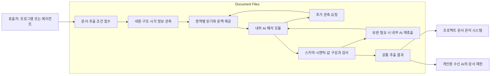

# Document Files AI-assisted 문서 스키마 추출 설계

- 작성·수정일: 2026-09-07
- 상태: 1.7.0 실험적 기능 배포 범위; 전체 설계 구현 진행 중
- 현재 구현 기준: Document Files 1.7.0
- 제품 구성: [DESIGN.md](DESIGN.md)

## 구현 상태 (2026-09-07)

내부 모델 호출·추가 읽기·응답 보완·JSON Schema 및 출처 검사·별도 AI 대조를 수행하는 엔진,
CLI/MCP 진입점과 결과 보관·조회, 교체 가능한 모델 연결부를 구현했다. 기존 분석 v1 계약은
유지한다. 현재 HTTP 연결부는 JSON 응답을 지원하는 Chat Completions 호환 서버를 대상으로
하며 Python ModelClient로 다른 추론 구현을 연결할 수 있다. 현재 대화의 모델 접근 권한이
플러그인의 독립 실행용 API 연결을 자동 제공하는 것은 아니다.

텍스트 원형과 Office/HWPX native 구성요소는 개인용 재현 맥락으로 포함한다. PDF/HWP의
전체 native 구성요소, 내부 시각 판독, 큰 문서의 분할 통합과 실제 모델·미지 문서 평가,
수신 AI 재현 시험은 미완료다. 1.7.0 배포는 현재 구현한 실행 경로를 대상으로 한다. 아래 설계의 목표 범위를 이 초기
구현으로 충족했다고 취급하지 않는다. 호출·옵션과 현재 제한은 [README.md](README.md)에 둔다.

## 1. 목적과 적용 범위

Document Files 자체를 **AI-assisted 문서 스키마 추출 도구**로 확장한다. 문서를 입력받으면 제품
내부에서 AI를 활용해 내용과 구조를 이해하고 스키마·시맨틱·값을 구성하여 반환한다. 특정 산업이나
업무, 미리 등록한 양식을 전제하지 않는다.

문서 관측, AI 호출과 문맥 구성, 추가 읽기, 해석 보완, 값 추출과 검사는 Document Files가 수행한다.
호출자는 문서와 선택적인 추출 조건을 전달하고 결과를 받는다. 일반 프로그램에서도 같은 기능을
호출할 수 있어야 하며, 별도의 호출자 AI가 해석안을 만들어 제출하는 절차를 필수로 두지 않는다.
기존 읽기·제작·편집과 같은 제품·패키지·도구·Skill에서 제공한다.

| 적용 | 요구하는 결과 | 결과를 활용하는 주체 |
| --- | --- | --- |
| 프로젝트 연계 | 문서 내용, 논리 구조, 항목의 의미와 관계, 값이 빠짐없이 연결된 추출 결과 | 프로젝트의 AI 에이전트와 문서 관리 시스템 |
| 개인용 Document Files | 수신 AI가 원본 파일 없이 문서를 이해하고 재현하는 데 충분한 내용·구조·의미·서식·자원 | 결과를 전달받은 AI/LLM과 그 AI가 사용하는 문서 제작 도구 |

프로젝트에서는 문서 이해와 스키마·시맨틱·값 추출을 완성한다. 회사별 양식, 필드 매핑, 화면,
렌더링과 최종 파일 생성은 문서 관리 시스템이 맡는다. 소프트젠은 그 백오피스 소프트웨어를 구현하는
회사다. Document Files의 일반 출력 계약에 회사별 템플릿이나 DB 제품을 고정하지 않는다.

개인용 요구에서는 추출 결과를 받은 AI가 재현 방법을 판단하고 사용할 도구를 선택한다. Document
Files는 그 판단과 제작에 필요한 정보를 보존한다. 전용 재구성기의 구현이나 원본 형식으로의 자동
왕복 변환은 공통 추출 기능의 완료 조건으로 두지 않는다. 개인용 AI 재현 가능성은 별도로 확인한다.

적용 범위와 역할은 사용자가 지정한 방향이다. 아래 출력 필드, 호출 계약과 구현 순서는 설계
제안이다. 현재 배포 기능이나 소프트젠과 합의한 연계 명세를 뜻하지 않는다.

## 2. 프로젝트 문서 생성에 필요한 입력

백오피스가 출력 양식과 필드 매핑·렌더링 규칙을 관리한다면, 스키마·시맨틱·값은 문서 생성에 필요한
입력을 제공할 수 있다. 생성 프로그램이 사용할 수 있도록 다음 정보가 명시되어야 한다.

| 정보 | 생성 프로그램에서의 사용 |
| --- | --- |
| 항목 식별자·자료형·값 | 대상 필드에 값을 연결하고 형식 검사 |
| 문서 계층·내용 순서·반복 구조 | 본문·표·목록과 반복 행 구성 |
| 항목의 의미·단위·코드 | 같은 이름이나 자료형의 항목을 구별하고 표시값 변환 |
| 적용 범위·조건·예외·참조 관계 | 적용할 값과 주석, 조건부 내용을 선택 |
| 원문 값·표기·출처·상태 | 원래 표현 확인, 누락·미확정 값의 처리 |
| 추출 계약·스키마 버전 | 수신 프로그램의 지원 범위와 매핑 일치 확인 |

이 조건을 충족하면 백오피스가 문서의 의미를 다시 추론해야 하는 부분을 줄일 수 있다. 자연어
설명만으로 남아 있는 조건을 프로그램이 실행 가능한 규칙으로 간주하지 않는다. 규칙이 필요한
항목에는 수신 측이 지원하는 구조화된 연산과 적용 대상을 연결하고, 해석하지 못한 조건은 표시한다.

스키마·시맨틱·값만으로 출력 양식까지 유일하게 정해지는 것은 아니다. 출력 양식이 전혀 없는 문서를
새로 구성하는 기능까지 필요하면 백오피스의 양식 구성 규칙이나 별도의 AI 구성 판단이 필요하다.
그 범위는 문서 생성 측에서 정하며, 원본의 완전한 외형 재현을 프로젝트 추출 요건에 포함하지 않는다.

현재 프로젝트의 문서 지식 구조는 영역·필드·반복 영역·의미 단서·원문 위치를 담는 초기 정보 모델이다.
Document Files의 일반 결과는 이 모델에 연결할 수 있지만, 적용 범위와 관계를 자유 형식의 의미
단서에만 넣어서는 프로그램이 직접 사용하기 어렵다. 실제 연계에서는 아래 시맨틱 계약과 프로젝트
모델의 대응을 확인한다. 회사별 필드 매핑과 출력 이력은 문서 관리 시스템의 계약을 따른다.

## 3. 제품 내부 구성과 결과 활용

| 구성 또는 활용 주체 | 맡을 일 |
| --- | --- |
| Document Files의 문서 읽기 모듈 | 파일 열기, 본문·표·셀·위치·서식·자원 읽기, 선언된 구조와 저장값 추출 |
| Document Files의 AI 해석 모듈 | 처음 보는 문서의 목적·영역·역할·반복·관계·조건을 해석하고 스키마와 값 연결을 구성 |
| Document Files의 실행·검사 모듈 | 문맥과 AI 요청 구성, 추가 관측·보완 반복 제어, 참조·자료형·범위 검사와 결과 확정 |
| 프로젝트의 문서 관리 시스템 | 회사별 양식·필드 매핑·출력 규칙과 문서 생성 |
| 개인용 결과를 받은 AI/LLM | 추출 결과를 이해하고 문서 제작 도구로 재현 |

추출용 AI는 제품의 내부 분석 구성 요소다. 개인용 결과를 받아 재현하는 AI는 추출 이후의 활용
주체다. 추출 단계와 재현 단계의 역할을 구분하며, 결과를 사용하는 프로그램에 문서 이해 절차를 맡기지 않는다.

내부 모델은 설정된 로컬 모델이나 LLM API로 연결할 수 있다. 이 연결 방식과 관계없이 프롬프트,
문서별 분석 절차, 문맥 선택, 보완 요청, 예산과 완료 판정은 Document Files가 소유한다. 모델
어댑터는 추론 요청과 응답의 연결을 맡으며 외부 에이전트가 전체 처리를 지휘하는 구조로 만들지 않는다.

문서 종류마다 의미 해석 규칙을 프로그램에 모두 작성하는 방식으로 확장하지 않는다. 제품 내부의
파서는 파일 형식과 명시적 구조를 처리하고 AI 해석 모듈은 문서마다 달라지는 의미와 관계를 처리한다.
셀 참조의 존재·자료형은 기계적으로 검사하고, 개념과 관계의 의미는 AI 해석과 원문 대조로 확인한다.

원문이 직접 선언한 정보, 기계적인 변환과 AI의 해석을 구분한다. 원문에 번호·제목 수준·머리글
표시가 있으면 그대로 읽고, 글자 크기나 배치로 제목·적용 범위를 판단했다면 해석 근거를 남긴다.
이 구분은 한 요소 안에서도 개별 주장마다 적용한다.

## 4. 처음 보는 문서를 읽는 흐름



### 4.1 관측과 읽기 문맥

파일을 읽어 문단·표·셀·그림·주석 등의 노드를 만들고 내용, 소속, 순서와 원문 위치를 연결한다.
표의 병합·다중 문단·중첩, 빈 셀과 서식만 있는 영역, 숨김 시트처럼 의미에 영향을 줄 수 있는
정보도 보존한다. 정규화 전 표기와 활용하기 좋게 변환한 값을 함께 다룬다.

내부 AI 해석 모듈에는 다음 문맥을 조합해 제공한다. 호출자가 이 문맥이나 문서별 프롬프트를
직접 조립할 필요가 없도록 한다.

- 문서 개요와 영역 목록, 제목 계층과 읽기 순서
- 표의 행·열 구조, 병합 범위와 원문이 선언한 머리글 정보
- 해당 영역의 본문, 주변 제목·설명·단위·주석과 연결 위치
- 그림·도식·시각적 배치가 의미를 전달하는 경우 해당 이미지나 영역 보기
- 각 정보의 관측 방법, 읽은 범위와 아직 읽지 못한 부분

처음부터 고정된 문서 유형으로 분류해야만 읽을 수 있는 구조로 만들지 않는다. 기존 데이터 스키마는
선택 입력으로 받고, 없으면 문서에서 항목과 관계를 발견한다. 이름이 비슷하거나 배치가 같다는
이유만으로 이전 문서의 의미를 적용하지 않는다.

### 4.2 추가 관측과 긴 문서

내부 AI가 모호한 관계를 확인하기 위해 앞뒤 영역, 표 전체, 페이지 이미지 또는 원문 세부 구조를
요청하면 Document Files가 같은 입력 버전의 해당 부분을 읽어 다시 분석에 제공한다. 이 반복은
제품 실행부가 관리하고, 호출자에게 문서 해석을 수행하는 후속 호출을 요구하지 않는다. 새로운 파일
형식의 지원과 이미 지원하는 형식 안의 새로운 양식 이해는 구분한다.

긴 문서는 영역별로 읽되 표 머리글, 상위 제목, 공통 단위와 주석이 따라가게 한다. 여러 페이지에 걸친
표나 문장, 반복 구역의 연결을 해석 결과에 남긴다. 일부 행만 모델에 보여 줬다면 실제 반복 범위를
도구가 순회하여 전체 값을 읽고, 의미가 달라지는 중간 머리글·합계·예외 행은 별도로 다룬다.

PDF·스캔·그림에 의미가 있으면 레이아웃 관측, OCR과 시각 해석을 사용할 수 있게 한다. 글자로
옮긴 결과와 이미지에서 해석한 관계는 원문 영역에 연결한다. 사용할 관측 기능이 없으면 필요한
영역을 미확인으로 남기며 임의의 다른 서버로 원문을 전송하지 않는다.

## 5. 스키마·시맨틱·값의 반환 계약

출력은 하나의 논리적인 결과다. 계약은 고정된 공통 형식으로 제공하고, 문서마다 발견하는 항목과
관계는 그 안의 스키마와 시맨틱 정의로 표현한다. 계약 이름은 `document-files.schema-extraction-result.v1`로
제안한다. 필드 구성은 이번 설계에서 구체화할 대상이며 아직 공개 API로 확정하지 않았다.

| 필드 | 내용 |
| --- | --- |
| `schemaVersion`, `jobId`, `source` | 결과 계약, 요청과 입력 버전·해시 |
| `documentSchema`, `document` | 공통 문서 표현의 정의, 원문 노드·내용·계층·순서·관측 정보 |
| `dataSchema`, `dataSchemaRevision` | 발견하거나 제공받은 항목의 JSON Schema와 버전 |
| `semantics` | 역할·개념·관계·적용 범위·조건과 각각의 근거·상태 |
| `data` | 스키마를 따르는 값, 반복 개체와 내용 |
| `schemaEvidence`, `valueEvidence` | 항목 정의와 값이 대응하는 원문 및 시맨틱 참조 |
| `extraction` | 요청 범위와 읽기·의미 해석·값 추출의 상태 |
| `coverage`, `validation`, `issues` | 읽기·해석·값 추출 범위, 검사 결과와 미확인 사항 |
| `provenance` | 실제 관측기·모델·해석 규칙과 실행 버전 |
| `reconstructionContext` | 개인용 전달에 포함할 서식·배치·자원·형식 고유 정보. 프로젝트 연계의 필수 입력과 구분 |

### 5.1 스키마와 값

`dataSchema`는 [JSON Schema Draft 2020-12](https://json-schema.org/draft/2020-12)를 기준으로 항목의
자료형, 객체·배열·계층·반복과 제약을 표현한다. 항목 키와 표시 이름은 구분한다. 한 문서에 값이
있었다는 사실만으로 필수 항목, 허용값이나 최대 반복 수를 일반화하지 않는다.

정규화 전 문자열과 저장 자료형은 `document`에 보존하고, 계산·조회에 사용할 값은 `data`에 둔다.
예를 들어 `0012.40`을 숫자 `12.4`로 사용해도 원문 표기는 남긴다. 큰 정수와 고정소수점의 정밀도를
유지하며, 수식은 식과 저장된 계산값을 구분한다. 없는 계산값을 임의로 채우지 않는다.

`0`, `false`, 빈 문자열, 명시적인 `null`, 값이 없는 항목과 읽지 못한 항목은 구분한다. 원본 셀이
비어 있으면 문서 모델에 빈 셀을 남기고 활용 데이터의 값은 스키마 규칙에 따라 처리한다. 문서의
서술문·정의·조건도 원문 노드와 시맨틱에 남기며 표의 숫자만 추출한 결과를 문서 전체 결과로 취급하지 않는다.

### 5.2 시맨틱

시맨틱은 프로그램이 참조할 수 있는 식별자와 구조, AI가 의미를 이해할 수 있는 설명을 함께 가진다.
다음 관계는 명시적인 반환 항목으로 둔다.

| 종류 | 표현할 내용 |
| --- | --- |
| 문서 역할 | 제목·정의·절차·기록·예시·합계·주석 등 영역이 맡는 역할 |
| 항목·개체 의미 | 무엇의 어떤 속성인지, 이름·정의·단위·코드와 대상 개체 |
| 머리글·문맥 | 상위 제목, 다단 머리글 경로, 행·열의 역할과 반복 단위 |
| 적용 범위 | 단위·조건·주석·공통 값이 적용되는 노드·필드·행 범위 |
| 관계 | 항목명과 값, 본문과 표·그림, 각주와 대상, 페이지 사이의 연속성 |
| 규칙·예외 | 적용 조건, 제외 조건, 비교·계산 관계와 명시된 제약 |

각 시맨틱 주장은 ID, 종류, 대상, 적용 범위, 설명, 원문 참조, 근거 유형과 해석 상태를 가진다.
노드·필드·데이터 경로의 참조 유형을 구별하고 문서 revision 안에서 식별자를 안정적으로 유지한다.
근거는 원문 선언, 명시적 변환, AI 해석으로 구분한다. 판단이 불명확한 관계는 그 상태와 필요한
추가 문맥을 남긴다. 점수 하나로 의미 해석의 정확성을 확정하지 않는다.

새로운 개념과 관계는 정의와 함께 추가할 수 있게 한다. 공통 연산과 관계의 의미는 유지하고,
수신 프로그램이 지원하지 않는 새 관계는 자동 실행하지 않도록 구분한다. 자연어 조건을 해석한
내용과 실행 가능한 조건식을 별도로 표현하여 프로그램이 자유 서술을 명령으로 취급하지 않게 한다.

### 5.3 내부 해석안과 값 연결

제품의 AI 해석 모듈은 내부 `InterpretationProposal`로 항목 정의, 문서 역할, 시맨틱 주장,
원문 연결, 반복 규칙과 이슈를 구성한다. 실행부는 노드·필드·행 참조, 중복 키, 자료형과 적용 범위를
확인하고 보완이 필요하면 내부 AI를 다시 호출한다. 이 해석안은 외부 호출자가 작성할 입력 계약으로
공개하지 않는다. 의미가 확정되지 않은 관계를 형식 검사 통과만으로 확정하지 않는다.

원문 값은 검증된 참조에서 도구가 읽는다. 숫자·날짜·단위 변환은 규칙과 조건을 기록하고, AI가
해석한 분류·관계는 원문 관측값과 구분한다. 반복 표에는 행 범위·열 대응과 예외 행 처리를 제안하고
도구가 실제 행을 구성한다. 모델이 모든 셀 값을 다시 출력하게 하지 않는다.

다음은 가상 표의 관계를 축약한 예다. `n-cell`은 `0012.40`, 행 머리글 `n-row`는 `시료 A`,
열 머리글 `n-header`는 `길이`이고 표 위의 `n-unit`은 `단위: mm`라고 가정한다. 이들이 속한
표는 `n-table`이다. 노드 정의와 스키마, 출처의 상세는 생략했다.

```json
{
  "data": {"measurements": [{"sample": "시료 A", "length": 12.4}]},
  "semantics": {
    "assertions": [
      {
        "id": "s-length",
        "kind": "propertyOf",
        "target": {"type": "dataPath", "path": "/measurements/0/length"},
        "subject": {"type": "dataPath", "path": "/measurements/0/sample"},
        "meaning": "해당 시료의 측정 길이",
        "sourceNodeIds": ["n-row", "n-header", "n-cell"],
        "basis": "ai_interpreted",
        "status": "interpreted"
      },
      {
        "id": "s-unit",
        "kind": "unitAppliesTo",
        "unit": "mm",
        "scope": [{"type": "schemaPath", "path": "/properties/measurements/items/properties/length"}],
        "sourceNodeIds": ["n-unit", "n-table"],
        "basis": "ai_interpreted",
        "status": "interpreted"
      }
    ]
  },
  "valueEvidence": [
    {"target": "/measurements/0/length", "sourceNodeIds": ["n-cell"], "semanticIds": ["s-length", "s-unit"], "basis": "normalize", "status": "present"}
  ]
}
```

원문의 단위 표기는 직접 읽을 수 있어도 그것이 적용되는 범위는 AI가 판단할 수 있으므로, 단위
문구의 관측과 `unitAppliesTo` 주장의 근거를 구분한다. 설명과 관계는 원문에 연결된 같은 결과에 남는다.

### 5.4 DB와 백오피스 전달

문서·노드·시맨틱 주장·스키마·값을 JSON이나 DB 레코드로 저장해 다시 읽을 수 있게 한다. 순서,
숫자 정밀도와 문서 버전을 보존하고 모든 참조를 해결할 수 있어야 한다. JSON Schema의 `$ref`와
실제 데이터의 개체 관계는 구분한다. DB 테이블과 DDL은 수신 시스템이 정한다.

전달 계약에서는 항목 식별자, 반복 개체의 식별, 단위·코드, 누락 상태, 시맨틱 범위와 버전의 매핑을
확인한다. 백오피스가 지원하는 양식과 생성 규칙에 연결할 수 있어야 연계 준비가 끝난다. 추출 결과의
완전성과 해당 백오피스에서 문서를 생성할 수 있는지는 별도 상태로 기록한다.

## 6. 개인용 AI 재현에 필요한 정보

개인용 사용에서는 같은 추출 결과에 `reconstructionContext`를 기본으로 포함한다. 수신 AI가 원본 없이
문서를 재현할 수 있도록 원래 표기, 문서 계층, 배치 단서, 스타일 정의, 그림·글꼴 등의 자원과
사용 관계를 보존한다. 형식 고유 정보도 의미·원문 위치와 연결해 추가 해석할 수 있게 제공한다.

자원은 결과와 함께 전달하거나 결과 안에서 해결되는 자원 ID로 묶는다. 독립 JSON은 Base64,
파일 묶음이나 DB는 실제 자원 파일·BLOB을 사용할 수 있다. 접근할 수 없는 원본 경로나 해시만
제공한 경우에는 재현에 필요한 자원이 전달됐다고 표시하지 않는다.

수신 AI는 공통 문서 표현과 시맨틱, 필요한 시각 자료를 읽고 문서 제작 도구를 사용한다. 기존
Document Files의 작성·편집 도구도 사용할 수 있다. AI가 사용할 수 있는 형식 고유 자료를 보존하는
것과 모든 형식의 전용 직렬화기를 Document Files에 구현하는 것은 별개의 선택이다.

개인용 재현 가능성을 확인할 때에는 원본에 접근하지 않는 수신 AI에 추출 결과만 제공하고, 생성한
문서의 내용·구조·의미·서식·배치를 대조한다. 확인한 모델·도구·문서와 남는 차이를 기록한다.
특정 사례의 성공을 모든 문서와 모델의 재현 보장으로 일반화하지 않는다. 이 확인은 프로젝트의
추출 완료나 매번의 도구 호출에 필수로 붙이지 않는다.

원본 파일 전체를 첨부하거나 페이지 이미지만 전달했다고 구조·의미 추출이 완료되는 것은 아니다.
이미지와 형식 고유 자원은 문서 모델과 시맨틱에 연결한다. 원본 자체가 스캔인 경우에는 이미지가
원문 자원이며 OCR·시각 해석 결과의 상태를 함께 남긴다.

## 7. 완료 기준

추출의 완전성은 지원하는 입력을 빠짐없이 읽고, 문서 내용과 의미 있는 구조를 연결하며, 요청한
스키마·시맨틱·값을 구성했는지로 판단한다. 전체 문서 이해를 기본 범위로 하고, 특정 항목만 요청한
부분 결과는 그 범위를 명시한다. 필드 선택이 원문 문맥을 삭제하는 이유가 되지 않게 한다.

| 확인 대상 | 확인할 내용 |
| --- | --- |
| 관측 범위 | 본문·표·그림·주석 등 의미를 전달하는 영역과 읽지 못한 범위 |
| 구조·의미 | 항목·개체·반복·머리글·단위·조건·예외의 연결, 미분류·상충 관계 |
| 값 | 원문 대응, 정밀도·자료형·누락 구분, 반복 행의 처리 |
| 계약 | 스키마 유효성, 참조·범위·버전·직렬화의 일관성 |
| 새로운 문서 | 사전 양식 없이 처음 보는 문서의 구조와 의미를 제품이 내부 AI를 사용해 해석하는지 |
| 독립 호출 | 설정된 모델 환경에서 일반 프로그램이 문서와 조건을 넘기면 외부의 해석안 제출 없이 결과를 받는지 |

관측된 의미 요소에는 해석 결과 또는 미확인 상태가 대응해야 한다. 조건·단위의 적용을 판단하지
못한 상태에서 핵심 값만 추출했다고 전체 완료로 표시하지 않는다. 원문에 필요한 값이 없는 경우와
추출기가 찾지 못한 경우도 구분한다. 완전성이 원문에 없는 사실까지 알아낸다는 뜻은 아니다.

빈 양식에서는 항목 구조와 기입 조건, 미기재 상태를 추출할 수 있다. 원문에 값이 없다는 사실과
추출 실패를 구분하며, 생성에 필요한 실데이터가 준비됐는지는 백오피스 연계에서 따로 판단한다.

`extraction.status`는 `complete`, `partial`, `failed`로 제안한다. 읽기·의미 해석·값 추출의 상태를
함께 기록하며 AI 해석의 의미적 타당성은 원문과 실제 사례로 확인한다. JSON 형식 검사만으로 의미
정확성을 판정하지 않는다. 개인용 재현 자료의 충분성과 실제 수신 AI의 재현 결과는 별도 상태로 두고,
재현을 실행하지 않았다는 이유로 프로젝트 추출 결과를 `partial`로 낮추지 않는다.

백오피스 연계 상태도 추출 상태와 구분한다. 추출은 완료됐어도 수신 프로그램의 필드 매핑이나
지원하지 않는 조건식 때문에 추가 연계 작업이 필요할 수 있다. 현재 단계에서 소프트젠의 실제
입력 계약을 확인한 것으로 표시하지 않는다.

## 8. 도구 호출과 작업 수명

### 8.1 외부 호출 계약

`SchemaExtractionJob`은 입력 형식·크기·해시와 별도 바이트 스트림, 선택적인 목적·기존 데이터
스키마, 개인용 재현 자료 포함 여부, locale·관측 조건과 실행 예산을 받는다. 호출자는 문서의
해석안이나 AI용 프롬프트를 작성할 필요가 없다. 결과 계약은 특정 모델이나 전송 방식에 종속하지 않는다.

| 도구 제안 | 동작 |
| --- | --- |
| `document_extract_schema` | 문서와 추출 조건을 받아 내부 AI 분석·추가 읽기·보완·검사를 실행하고 스키마·시맨틱·값을 반환 |
| `document_get_extraction` | 같은 작업의 진행 상태 또는 저장된 최종 결과를 조회. 큰 결과는 범위를 나누어 조회 |

CLI·Python·MCP는 같은 제품 실행 함수를 호출한다. 기존의 원문 읽기와 구조 추출 도구는 유지한다.
새 이름은 AI-assisted 추출의 공개 진입점 제안이다. 내부 해석안 제출이나 분석 단계별 판단을
외부 호출자의 필수 작업으로 노출하지 않는다.

기본 호출은 결과가 확정될 때까지 실행한다. 긴 작업을 비동기로 제공하려면 Document Files 실행
환경에 실제 작업 실행기와 상태 저장소가 있어야 한다. 호출이 끝나도 내부 처리를 계속할 수 있을 때만
작업 ID와 진행 상태를 반환한다. 호출자는 진행·결과를 조회하며 문서 해석의 다음 단계를 결정하지 않는다.

### 8.2 내부 AI 처리

제품의 문서 이해 엔진이 관측 결과와 추출 조건에서 분석 요청을 만들고 설정된 모델을 호출한다.
응답에 필요한 추가 관측이나 보완을 확인하여 읽기 모듈과 AI 해석 모듈을 다시 실행한다. 스키마
발견, 시맨틱의 적용 범위 판단, 원문 값 연결과 결과 검사를 정해진 예산 안에서 완료한다.

`InterpretationProposal`은 이 과정의 내부 계약이다. 잘못된 참조·범위·변환은 내부 보완 입력으로
사용하며, 해결되지 않은 사항은 최종 결과에 남긴다. LLM의 출력 형식을 제한하는 API는 내부 해석안에
적용하고 외부 데이터 스키마를 그 API의 제약에 맞춰 축소하지 않는다.

핵심 프롬프트, 분석 규칙, 추가 읽기와 보완 절차는 Document Files의 실행 코드와 버전 관리되는
설정이 소유한다. Skill은 호출 방법과 결과 활용을 안내한다. Skill을 읽은 외부 에이전트가 그 절차를
재구현해야만 추출을 완료할 수 있는 구조로 두지 않는다.

### 8.3 모델 설정과 실행 상태

로컬 모델과 LLM API는 `ModelClient` 어댑터로 연결한다. 어댑터는 추론 요청·응답을 전달하고,
문서별 분석 계획과 프롬프트·도구 선택·재시도는 제품 내부 엔진이 맡는다. 실행 환경은 모델 접속,
인증정보와 사용 가능한 읽기 기능을 설정한다. 인증정보와 접속 비밀값은 결과에 저장하지 않고,
실제 모델 ID·버전과 비밀값을 제외한 설정 식별 정보는 provenance에 남긴다.

AI 분석에 필요한 모델이 설정되지 않았으면 `ai_unavailable` 등 명시적인 실행 상태를 반환한다.
이미 수행한 원문 관측은 실제 범위와 함께 제공할 수 있지만 AI-assisted 추출의 완료로 표시하지
않는다. 외부 호출자에게 해석 프롬프트를 돌려주어 대신 수행하도록 하는 자동 폴백은 두지 않는다.

입력 해시·문서 revision·요청·모델 설정 식별자·프롬프트 버전은 작업에 고정한다. 같은 요청 ID의
재시도는 입력과 조건을 대조한 뒤 같은 작업의 상태나 저장된 결과를 반환한다. 다른 입력에 같은
요청 ID를 사용하면 불일치를 반환하고 전체 AI 분석을 임의로 다시 시작하지 않는다.
원문 관측·분석·보완·검사 중 어느 단계까지 수행했는지와 최종 추출 상태를 구분한다.

전체 결과는 페이지로 나누기 전에 검사하며 일부 행·노드·자원만 있는 응답을 전체 결과로 표시하지
않는다. 임시 작업 저장소의 수명과 내보낸 결과의 장기 보관은 구분한다. 문서는 데이터로 취급하고
문서 안의 지시로 모델·도구·권한을 바꾸지 않는다. 스키마의 외부 참조를 자동으로 가져오지 않으며
모델 호출·추가 관측·보완 횟수·처리 시간에는 실행 한도를 적용한다.

## 9. 현재 구현과 확장 지점

현재 `AnalysisJob`·`AnalysisResult`는 원문 관측 계약이다. `structured-extraction.v1`의 시맨틱은
원문에 선언된 구조를 중심으로 제공하며 인접 셀의 의미를 추론하지 않는다. 이 계약을 유지하고
새 추출 계약과 제품 내부 AI 해석 모듈에서 판단과 연결을 다룬다.

현재 분석에서는 공백 정규화와 일부 빈 셀 생략이 있고 PDF는 페이지별 텍스트 추출이 중심이다.
문서 이해에 영향을 주는 원문 표기·빈 영역·배치·시각 정보와 개인용 재현 자료를 보강한다. 기존
읽기용 문자열을 모든 목적의 원문 정본으로 사용하지 않는다.

| 재사용할 구성 | 확장 내용 |
| --- | --- |
| `analysis.py`, 입력 해시와 분석 manifest | 같은 문서 버전의 관측·해석 연결 |
| `read_projection.py`의 위치 기반 셀 조립 | 여러 추출 단위를 실제 셀과 문맥으로 묶기 |
| `structured_extraction.py`, 형식별 파서 | 선언된 구조·원문 값과 내부 AI가 읽을 관측 정보 |
| 형식별 추가 관측 기능 | PDF·스캔·그림의 레이아웃·OCR·이미지 조회 |
| CLI·MCP·host runtime | 같은 AI-assisted 추출 엔진과 결과 계약 제공 |

제안하는 내부 구성은 다음과 같다. 아직 구현 파일을 추가한 상태는 아니다.

```text
src/document_files/document_model/
  contracts.py       # 원문 노드·관측·자원과 문맥 계약
  capture.py         # 내용·구조 관측과 형식별 추가 읽기
  context.py         # 영역·계층·표·시각 자료를 내부 AI에 제공
  references.py      # 원문·노드·범위·자원 연결
  serialization.py   # 공통 결과와 개인용 재현 자료 저장·조회
src/document_files/interpretation/
  contracts.py       # 외부 추출 요청·결과와 내부 해석안·상태
  engine.py          # AI 분석·추가 읽기·보완·완료를 제어하는 문서 이해 엔진
  prompts.py         # 제품이 소유하는 분석 프롬프트·응답 규칙과 버전
  semantics.py       # 역할·개념·관계·범위·조건의 공통 표현
  schema.py          # 데이터 스키마 생성·재사용
  values.py          # 검증된 참조의 값 읽기와 명시적 변환
  validation.py      # 원문 대응·계약·범위와 미확인 사항 검사
  workflow.py        # 추출 실행·작업 상태·결과 조회와 수명
  backends.py        # 로컬 모델·LLM API의 ModelClient 연결
```

JSON Schema 검사는 직접 선언한 실행 의존성으로 제공하고, 날짜 등 지원하는 형식 검사는 명시적으로
설정한다. AI 추출에는 설정된 모델 연결이 필요하고 일반 원문 읽기는 기존 실행 조건을 유지한다.
모델 접속 방식별 의존성과 capability를 명시한다. 새 기능을 구현할 때 CLI·MCP·단일 Skill과 배포
목록을 갱신하고 OpenAI 실행 번들은 같은 소스에서 생성한다. 현행 분석 계약과 Sync 경로는 유지한다.

## 10. 구현 순서와 확인 사례

| 단계 | 구현할 내용 | 확인할 결과 |
| --- | --- | --- |
| 1 | 공통 문서 표현과 스키마·시맨틱·값 계약 | 항목·범위·관계·값·근거·상태가 서로 연결됨 |
| 2 | 기존 파서의 문맥 보강과 필요한 시각 관측 | 문단·표·양식·그림에서 내부 AI가 읽을 정보가 제공됨 |
| 3 | 내부 문서 이해 엔진·모델 어댑터·추출 진입점 | 일반 프로그램의 요청만으로 내부 AI 분석·보완·결과 반환이 완료됨 |
| 4 | 처음 보는 문서와 기존 스키마의 재적용 | 외부 해석안 없이 표 배치·머리글·단위·조건·반복의 의미와 값 연결을 확인함 |
| 5 | 프로젝트 출력 계약과 백오피스 매핑 | 추출 결과를 합의한 입력으로 받고 문서를 생성하는 연계를 확인함 |
| 6 | 개인용 재현 자료와 수신 AI 활용 | 원본 없이 받은 결과로 AI가 문서를 이해·재현할 수 있는지 확인함 |

초기 확인에는 표 중심 문서, 서술형 문서, 빈 양식과 작성된 기록, 다단 머리글·중첩 표·페이지 연속,
단위·각주·조건이 분산된 문서, 스캔·그림을 포함한다. HWPX 등 이미 읽을 수 있는 형식에서 시작하되
한 양식의 성공을 일반화하지 않는다. 새로운 파일 형식의 파서 개발과 지원 형식 안의 새로운 문서
해석을 구분한다.

확인에 쓸 문서는 구현·프롬프트 조정에 사용한 사례와 새로 적용할 사례를 구분한다. 기존 셀 주소나
정답 매핑을 주지 않은 상태에서 제품이 개요·구조·의미·값을 읽는지 살핀다. 실제 모델 연결을 설정한
일반 프로그램에서 문서와 조건만 넘겨 추출을 완료하는 흐름을 확인한다. 같은 스키마를 쓸 때에도
제품이 새 문서의 항목을 다시 연결한다. 개인용 재현 성과가 프로젝트 추출 기능의 구현 순서를 막지
않도록 한다.

이 단계에서는 플랜과 계약을 정리한다. 실제 운영 호스트, 전달 문서의 범위와 백오피스 입력 계약은
구현·연계 시 확인하며, 새로운 구현 코드·테스트 자산·배포를 완료한 것으로 보고하지 않는다.
